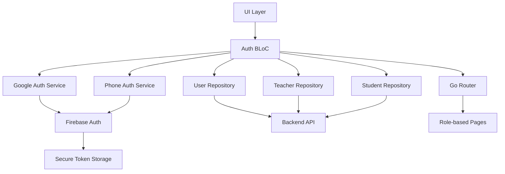
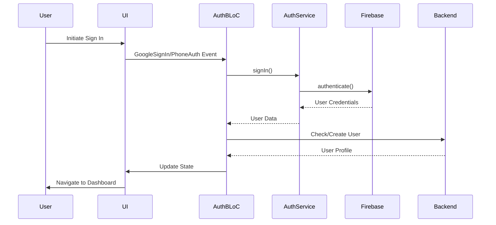

# Design Document

## Overview

The Authentication & User Management system builds upon the existing Firebase Auth foundation to provide comprehensive user authentication, role-based access control, and profile management for LumenSlate. The system supports Google OAuth and phone authentication with persistent sessions, automatic role assignment, and secure token management.

## Architecture

### High-Level Architecture



### Authentication Flow



## Components and Interfaces

### 1. Enhanced Authentication Services

#### GoogleAuthService (Enhanced)
```dart
class GoogleAuthService {
  // Existing methods remain
  Future<Map<String, dynamic>?> signIn();
  Future<void> signOut();
  Stream<User?> firebaseUserStream();
  
  // New methods for enhanced functionality
  Future<bool> isSignedIn();
  Future<void> refreshToken();
  Future<Map<String, dynamic>?> getCurrentUserInfo();
}
```

#### PhoneAuthService (Enhanced)
```dart
class PhoneAuthService {
  // Existing methods remain
  Future<void> signInOTP(String countryCode, String phoneNumber);
  Future<Map<String, dynamic>?> verifyOTP(String otp);
  
  // New methods for enhanced functionality
  Future<void> resendOTP();
  bool canResendOTP();
  Duration getTimeUntilResend();
  Future<void> cancelVerification();
}
```

### 2. Session Management Service

```dart
class SessionManager {
  static const Duration SESSION_DURATION = Duration(days: 30);
  static const Duration INACTIVE_TIMEOUT = Duration(days: 7);
  
  Future<void> initializeSession(User user);
  Future<bool> isSessionValid();
  Future<void> refreshSession();
  Future<void> invalidateSession();
  Future<void> trackActivity();
  Stream<SessionState> sessionStateStream();
}
```

### 3. Profile Management Service

```dart
class ProfileService {
  Future<LumenUser?> getCurrentProfile();
  Future<bool> updateProfile(LumenUser updatedUser);
  Future<bool> updateProfilePicture(File imageFile);
  Future<bool> verifyEmailChange(String newEmail);
  Future<bool> verifyPhoneChange(String newPhone, String otp);
  Future<bool> validateProfileData(LumenUser user);
}
```

### 4. Role Management Service

```dart
class RoleManager {
  Future<UserRole> determineUserRole(String email);
  Future<bool> assignRole(String userId, UserRole role);
  Future<bool> hasPermission(UserRole role, String permission);
  Future<List<String>> getRolePermissions(UserRole role);
  bool canAccessRoute(UserRole role, String route);
}
```

### 5. Enhanced Auth BLoC

#### New Events
```dart
// Session Management
class CheckSession extends AuthEvent {}
class RefreshSession extends AuthEvent {}
class SessionExpired extends AuthEvent {}

// Phone Authentication
class InitiatePhoneAuth extends AuthEvent {
  final String countryCode;
  final String phoneNumber;
}
class VerifyPhoneOTP extends AuthEvent {
  final String otp;
}
class ResendPhoneOTP extends AuthEvent {}

// Profile Management
class UpdateProfile extends AuthEvent {
  final LumenUser updatedUser;
}
class UpdateProfilePicture extends AuthEvent {
  final File imageFile;
}
class VerifyEmailChange extends AuthEvent {
  final String newEmail;
}
class VerifyPhoneChange extends AuthEvent {
  final String newPhone;
  final String otp;
}
```

#### New States
```dart
// Phone Authentication States
class PhoneAuthInitiated extends AuthState {
  final String phoneNumber;
}
class PhoneAuthOTPSent extends AuthState {
  final String phoneNumber;
  final Duration timeUntilResend;
}
class PhoneAuthVerifying extends AuthState {}

// Profile Management States
class ProfileUpdating extends AuthState {}
class ProfileUpdated extends AuthState {}
class ProfileUpdateFailed extends AuthState {
  final String error;
}

// Session States
class SessionExpiring extends AuthState {
  final Duration timeUntilExpiry;
}
class SessionRefreshed extends AuthState {}
```

## Data Models

### Enhanced LumenUser Model
```dart
class LumenUser {
  final String id;
  final String name;
  final String email;
  final String? role;
  final String? phone;
  final String? photoUrl;
  final DateTime? lastLoginAt;
  final DateTime? createdAt;
  final DateTime? updatedAt;
  final bool isEmailVerified;
  final bool isPhoneVerified;
  final Map<String, dynamic>? preferences;
  
  // Existing methods remain
  // New methods for enhanced functionality
  bool get isProfileComplete;
  bool get requiresRoleSelection;
  Duration get timeSinceLastLogin;
}
```

### Session Model
```dart
class UserSession {
  final String userId;
  final String sessionId;
  final DateTime createdAt;
  final DateTime expiresAt;
  final DateTime lastActivityAt;
  final String deviceInfo;
  final bool isActive;
  
  bool get isExpired;
  bool get isInactive;
  Duration get timeUntilExpiry;
}
```

### Authentication Result Model
```dart
class AuthResult {
  final bool success;
  final LumenUser? user;
  final String? error;
  final AuthResultType type;
  final Map<String, dynamic>? metadata;
}

enum AuthResultType {
  googleSignIn,
  phoneSignIn,
  sessionRestore,
  profileUpdate,
  roleAssignment
}
```

## Error Handling

### Authentication Errors
```dart
enum AuthError {
  networkError,
  invalidCredentials,
  userNotFound,
  emailAlreadyInUse,
  phoneAlreadyInUse,
  invalidOTP,
  otpExpired,
  tooManyRequests,
  sessionExpired,
  permissionDenied,
  profileIncomplete,
  roleNotAssigned
}

class AuthException implements Exception {
  final AuthError error;
  final String message;
  final String? code;
  final Map<String, dynamic>? details;
}
```

### Error Recovery Strategies
- **Network Errors**: Automatic retry with exponential backoff
- **Token Expiry**: Automatic refresh attempt before prompting re-authentication
- **OTP Errors**: Clear error messaging with resend options
- **Profile Validation**: Field-specific error highlighting
- **Session Expiry**: Graceful redirect to login with context preservation

## Security Considerations

### Token Management
- Secure storage using Flutter Secure Storage
- Automatic token refresh before expiry
- Token invalidation on sign out
- Protection against token theft with device binding

### Session Security
- Session timeout after inactivity
- Device fingerprinting for session validation
- Suspicious activity detection and session invalidation
- Secure session storage with encryption

### Data Protection
- PII encryption in local storage
- Secure transmission over HTTPS
- Input validation and sanitization
- Protection against common attacks (CSRF, XSS)

## Testing Strategy

### Unit Tests
- Authentication service methods
- BLoC event handling and state transitions
- Data model validation and serialization
- Error handling scenarios
- Session management logic

### Integration Tests
- End-to-end authentication flows
- Role-based access control
- Profile management workflows
- Session persistence and restoration
- Cross-platform compatibility

### Widget Tests
- Authentication UI components
- Form validation
- Error state displays
- Loading indicators
- Role-specific navigation

### Security Tests
- Token security validation
- Session hijacking prevention
- Input validation testing
- Permission boundary testing
- Data encryption verification

## Performance Considerations

### Optimization Strategies
- Lazy loading of user profiles
- Efficient token refresh scheduling
- Minimal network requests during session checks
- Cached user permissions for quick access checks
- Optimized image handling for profile pictures

### Monitoring
- Authentication success/failure rates
- Session duration analytics
- Performance metrics for auth flows
- Error frequency tracking
- User experience metrics

## Platform-Specific Implementations

### Web Platform
- Firebase Auth popup for Google Sign-in
- Browser-based session storage
- Web-specific OTP handling
- Responsive authentication UI

### Mobile Platform (Future)
- Native Google Sign-in integration
- Biometric authentication support
- Push notification for OTP
- Deep linking for email verification

## Migration Strategy

### Phase 1: Enhanced Current Implementation
- Improve existing Google Auth flow
- Add session management
- Enhance error handling
- Add profile management

### Phase 2: Phone Authentication
- Implement phone auth service
- Add OTP verification UI
- Integrate with existing user flow
- Add phone verification to profiles

### Phase 3: Advanced Features
- Add biometric authentication
- Implement advanced session management
- Add security monitoring
- Enhance role management

## API Integration

### Backend Endpoints
```
POST /api/auth/google - Google authentication
POST /api/auth/phone/initiate - Initiate phone auth
POST /api/auth/phone/verify - Verify OTP
POST /api/auth/refresh - Refresh tokens
GET /api/user/profile - Get user profile
PUT /api/user/profile - Update user profile
POST /api/user/role - Assign user role
DELETE /api/auth/session - Sign out
```

### Request/Response Formats
- Standardized error responses
- Consistent data structures
- Proper HTTP status codes
- Security headers implementation