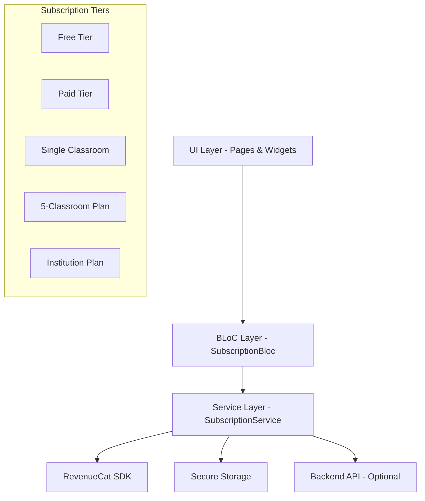

# Design Document

## Overview

The subscription system will be built using RevenueCat as the cross-platform subscription management service, integrated with Flutter's BLoC architecture. The system will provide a clean separation between data access, business logic, and UI presentation layers. The design emphasizes secure storage, offline capability, and robust error handling while maintaining the existing app architecture patterns.

## Architecture

### High-Level Architecture



### Data Flow

1. **Initialization**: App starts → SubscriptionService checks RevenueCat → Updates local storage → Notifies BLoC
2. **Purchase Flow**: User selects plan → UI triggers BLoC event → Service handles RevenueCat purchase → Updates entitlements
3. **Usage Validation**: Feature access → BLoC checks entitlements → Enforces limits → Updates UI state
4. **Restoration**: User triggers restore → Service queries RevenueCat → Updates local state → Refreshes UI

## Components and Interfaces

### Core Service Layer

#### SubscriptionService
```dart
abstract class SubscriptionService {
  Future<List<SubscriptionPlan>> getAvailablePlans();
  Future<PurchaseResult> purchasePlan(String planId);
  Future<RestoreResult> restorePurchases();
  Future<SubscriptionEntitlement?> getCurrentEntitlement();
  Future<UsageStats> getCurrentUsage();
  Stream<SubscriptionEntitlement?> get entitlementStream;
  Future<bool> hasEntitlement(String entitlementId);
  Future<void> syncWithRevenueCat();
}
```

#### RevenueCatSubscriptionService (Implementation)
- Handles all RevenueCat SDK interactions
- Manages purchase flows and restoration
- Implements secure storage for offline access
- Provides real-time entitlement updates

### State Management Layer

#### SubscriptionBloc
```dart
class SubscriptionBloc extends Bloc<SubscriptionEvent, SubscriptionState> {
  // Events: LoadSubscription, PurchasePlan, RestorePurchases, CheckUsage
  // States: Loading, Loaded, Purchasing, Error, UsageLimitReached
}
```

#### SubscriptionState Hierarchy
- `SubscriptionInitial`
- `SubscriptionLoading`
- `SubscriptionLoaded`
- `SubscriptionPurchasing`
- `SubscriptionError`
- `UsageLimitReached`

### Data Models

#### SubscriptionPlan
```dart
class SubscriptionPlan {
  final String id;
  final String title;
  final String description;
  final double monthlyPrice;
  final double annualPrice;
  final List<String> features;
  final Map<String, int> limits;
  final bool isPopular;
}
```

#### SubscriptionEntitlement
```dart
class SubscriptionEntitlement {
  final String planId;
  final DateTime expirationDate;
  final bool isActive;
  final Map<String, int> usageLimits;
  final Map<String, int> currentUsage;
}
```

#### UsageStats
```dart
class UsageStats {
  final Map<String, int> dailyUsage;
  final Map<String, int> weeklyUsage;
  final Map<String, int> monthlyUsage;
  final DateTime lastResetDate;
}
```

### UI Components

#### PricingScreen
- Displays all subscription plans in a responsive grid
- Handles monthly/annual toggle with 15% discount visualization
- Integrates with SubscriptionBloc for purchase flows
- Shows current plan status and upgrade options

#### PlanCard Widget
- Reusable component for displaying individual plans
- Highlights popular plans and current user plan
- Shows feature lists and pricing information
- Handles purchase button states (loading, disabled, etc.)

#### UsageDashboard Widget
- Displays current usage statistics
- Shows progress bars for various limits
- Provides upgrade prompts when approaching limits

## Data Models

### Subscription Tiers Configuration

```dart
enum SubscriptionTier {
  free,
  paid,
  singleClassroom,
  fiveClassroom,
  institution
}

class SubscriptionLimits {
  static const Map<SubscriptionTier, Map<String, int>> limits = {
    SubscriptionTier.free: {
      'messagesPerDay': 20,
      'tutorAgentPerDay': 2,
      'reportCardPerDay': 1,
      'assignQuizzesPerDay': 3,
    },
    SubscriptionTier.paid: {
      'messagesPerDay': 5,
      'questionsPerDay': 20,
      'documentsPerWeek': 1,
      'aiAgentUsesPerDay': 5,
      'exportsPerDay': 10,
    },
    SubscriptionTier.singleClassroom: {
      'teachers': 1,
      'studentsPerClassroom': 60,
      'classrooms': 1,
      // Inherits paid tier limits
    },
    SubscriptionTier.fiveClassroom: {
      'teachers': 1,
      'classrooms': 5,
      'studentsPerClassroom': 60,
      // Enhanced limits for multiple classrooms
    },
  };
}
```

### RevenueCat Configuration

```dart
class RevenueCatConfig {
  static const String apiKey = 'your_revenuecat_api_key';
  static const Map<String, String> entitlementIds = {
    'paid_tier': 'paid_features',
    'single_classroom': 'classroom_features',
    'five_classroom': 'multi_classroom_features',
    'institution': 'institution_features',
  };
}
```

## Error Handling

### Error Types and Handling Strategy

1. **Network Errors**: Graceful degradation with cached data
2. **Purchase Errors**: User-friendly messages with retry options
3. **Validation Errors**: Fallback to Free tier with notification
4. **Storage Errors**: Re-sync with RevenueCat on next app launch

### Error Recovery Mechanisms

- Automatic retry for transient network failures
- Cached entitlement data for offline scenarios
- Graceful degradation to Free tier when validation fails
- User-initiated manual sync options

## Testing Strategy

### Unit Testing
- SubscriptionService methods with mocked RevenueCat responses
- BLoC state transitions and event handling
- Data model serialization/deserialization
- Usage limit validation logic

### Integration Testing
- End-to-end purchase flows in test environment
- Restoration flow testing across different scenarios
- Entitlement validation with various subscription states
- Offline/online state transitions

### Widget Testing
- PricingScreen rendering with different subscription states
- PlanCard interactions and state changes
- UsageDashboard display accuracy
- Error state UI handling

### Platform Testing
- iOS App Store sandbox testing
- Google Play Console testing
- Cross-platform purchase restoration
- Platform-specific billing flow validation

## Security Considerations

### Data Protection
- Use flutter_secure_storage for sensitive subscription data
- Encrypt cached entitlement information
- Validate all subscription data server-side when possible
- Implement certificate pinning for RevenueCat API calls

### Fraud Prevention
- Server-side receipt validation through RevenueCat webhooks
- Regular entitlement synchronization
- Usage tracking with server-side validation
- Anomaly detection for unusual usage patterns

## Performance Optimization

### Caching Strategy
- Cache subscription plans for offline access
- Store entitlement data locally with TTL
- Implement background sync for usage statistics
- Use efficient data structures for usage tracking

### Network Optimization
- Batch API calls where possible
- Implement exponential backoff for failed requests
- Use compression for large data transfers
- Minimize RevenueCat API calls through smart caching

## Monitoring and Analytics

### Key Metrics
- Subscription conversion rates by plan
- Purchase funnel drop-off points
- Usage pattern analysis by tier
- Churn rate and retention metrics

### Error Tracking
- Purchase failure rates and reasons
- Restoration success rates
- Entitlement validation failures
- Network connectivity issues

## Migration Strategy

### Existing Users
- Grandfather existing users into appropriate tiers
- Provide migration notifications and upgrade paths
- Maintain backward compatibility during transition
- Implement gradual rollout with feature flags

### Data Migration
- Migrate existing usage data to new tracking system
- Preserve user preferences and settings
- Ensure seamless transition without service interruption
- Implement rollback mechanisms for critical issues