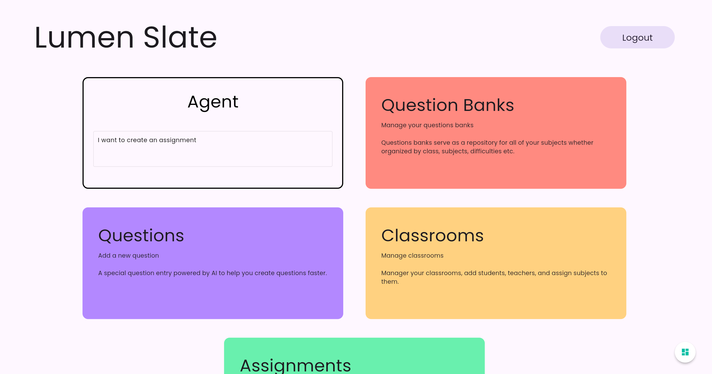
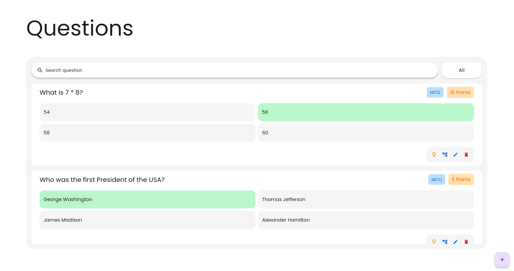
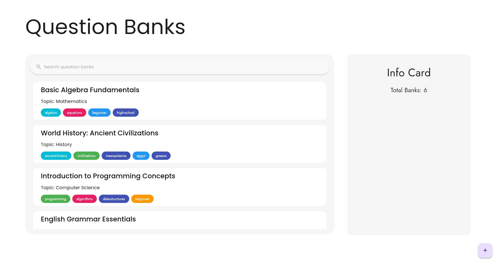
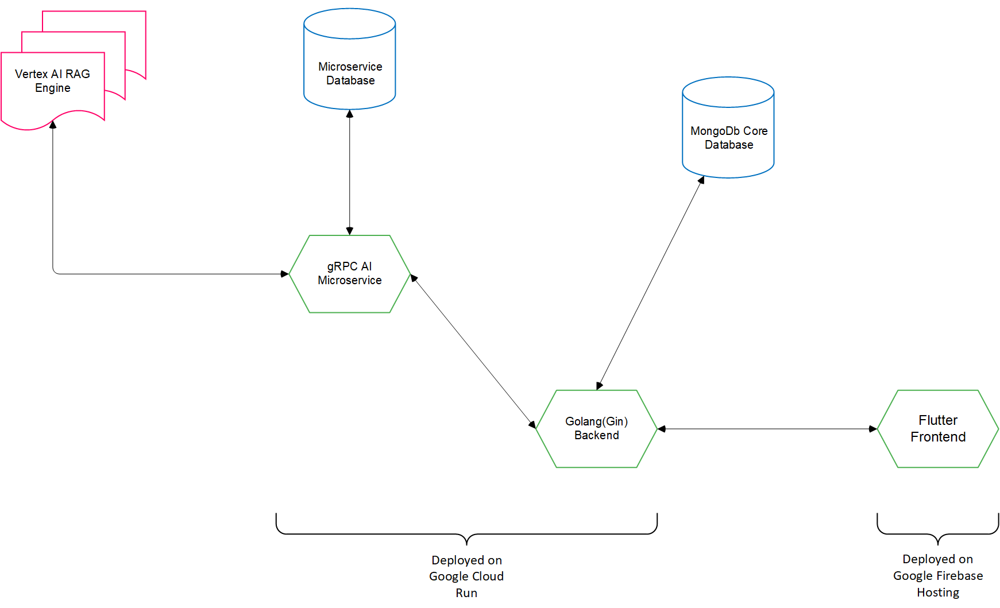
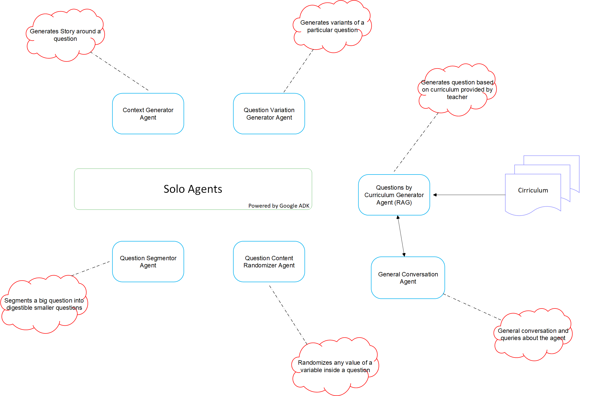
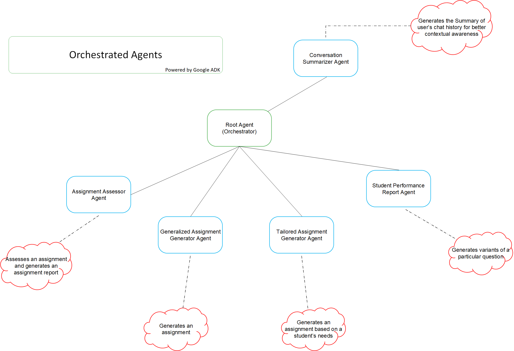

# LumenSlate

> *AI-powered Teaching Assistant for Educators*  
> Lighten Teachers’ Loads with Smart, Agent-Driven Workflows — Because Teaching Is More Than Paperwork.

---

## 🔗 Repository & Demo Links

> ⚠️ **Note:** This repository **only contains the Flutter frontend code**.  
> The backend and AI microservice code are hosted in separate repositories.

| Link Type | URL |
|----------|-----|
| 🧩 Frontend (Flutter Web) | [GitHub](https://github.com/Lumen-Slate/lumenslate.alpha.flutter.app) |
| ⚙️ Backend (Go + MongoDB) | [GitHub](https://github.com/Lumen-Slate/lumenslate.alpha.gin.server) |
| 🤖 AI Microservice (gRPC) | [GitHub](https://github.com/Lumen-Slate/lumenslate.alpha.gRPC.microservice.ai) |
| 📹 Demo Video (3 min) | [Watch on Vimeo](https://vimeo.com/1094177673/9b0442be5d) |
| 🌐 Live MVP | [Visit](https://lumen-slate.firebaseapp.com) |

---

## 🧾 About the Project

**LumenSlate** is an AI-first assistant for classrooms and coaching centres.  
It evaluates MCQ, MSQ, NAT, and Subjective answers, and generates constructive feedback—completely automated.

- ✅ Teachers save hours  
- ✅ Students get individual attention  
- ✅ Plagiarism is reduced  
- ✅ Learning is gamified and personalised

---

## 🖼️ MVP Snapshots

### Dashboard


### Questions Page


### Questions Bank Page


---

## 🧩 Architecture Overview

### ⚙️ System Architecture


---

### 🤖 Solo Agents – Powered by Google ADK


---

### 🧠 Orchestrated Agents – Powered by Google ADK


---

## 🚀 Getting Started

```bash
# Install Flutter
https://flutter.dev/docs/get-started/install

# Install dependencies
flutter pub get

# Run the app locally
flutter run -d chrome

# Build for production
flutter build web
````

---

## 📁 Project Structure

```
lib/         → Dart source code  
web/         → Web entrypoint and static assets  
assets/      → Local images and resources  
firebase/    → Firebase-related configuration  
```

---

## 🌟 Features

### 👩‍🏫 For Teachers

* 💡 AI-generated context for stale questions
* 🔁 Unique variants for each student
* ✍️ Prompt-based assignment generation
* 📝 Auto-grading with personalised feedback
* ✂️ Smart segmentation for long questions

### 👨‍🎓 For Students (Planned Phase)

* 🎤 Voice / 🧾 Text / 📎 Doc submission
* 📈 AI-generated progress reports
* 🕹️ Gamified learning and interaction

---

## 🧠 Tech Stack

| Layer               | Tech Stack                                                               |
| ------------------- | ------------------------------------------------------------------------ |
| **Frontend**        | Flutter Web                                                              |
| **Backend**         | Go (Gin), Firebase                                                       |
| **AI Microservice** | gRPC, Vertex AI, Gemini                                         |
| **Database**        | MongoDB                                                                  |
| **Infra**           | Google Cloud Run (backend & microservice)<br>Firebase Hosting (frontend) |
| **Other APIs**      | Google Speech-to-Text, Vertex AI RAG                                     |

---